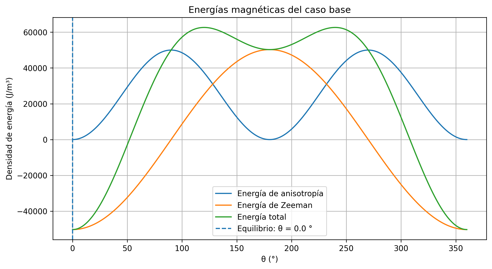
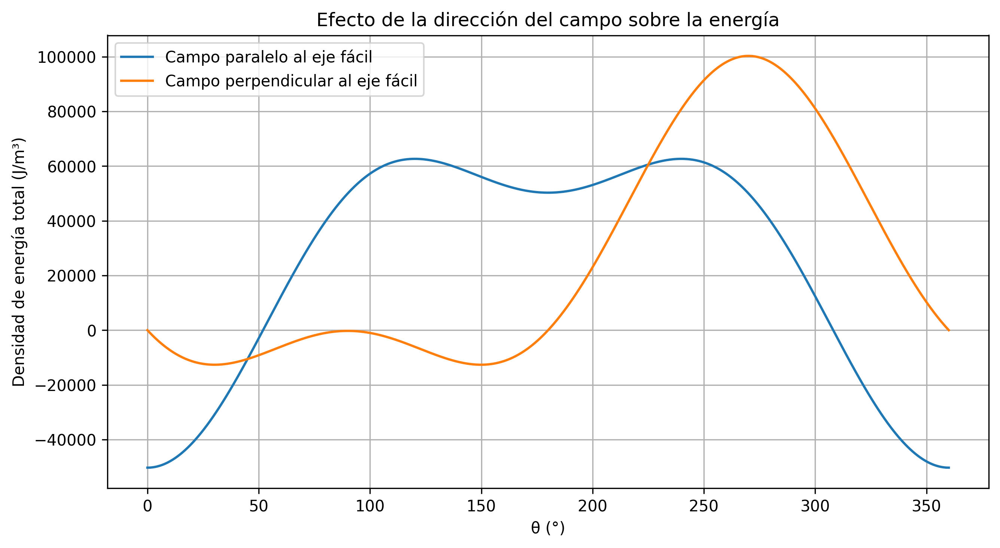
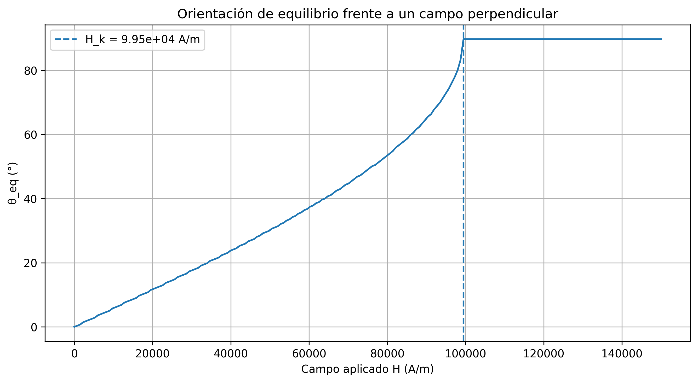
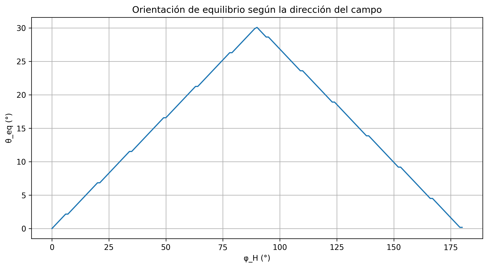

# 🧲 Magnetic Anisotropy Model
A simple Python model to study the equilibrium orientation of the magnetization in a magnetic thin film with uniaxial anisotropy under an external magnetic field.
The model combines **uniaxial anisotropy energy** and **Zeeman energy** and determines the equilibrium magnetization direction through numerical minimization of the total energy.

---

## 🔬 Physical model
The uniaxial anisotropy energy density is

$$
E_{\mathrm{an}} = K_u \sin^2(\theta)
$$

where:
- $K_u$ is the uniaxial anisotropy constant.
- $\theta$ is the angle of the magnetization with respect to the easy axis.

The Zeeman energy density is

$$
E_Z = -\mu_0 M_s H \cos(\theta - \phi_H)
$$

where:

- $\mu_0$ is the permeability of vacuum.
- $M_s$ is the saturation magnetization.
- $H$ is the applied magnetic field.
- $\phi_H$ is the direction of the applied field.

The total energy density is therefore

$$
E_{\mathrm{total}} = E_{\mathrm{an}} + E_Z
$$

or explicitly,

$$
E_{\mathrm{total}} = K_u \sin^2(\theta) - \mu_0 M_s H \cos(\theta - \phi_H)
$$

The equilibrium magnetization direction is obtained by finding the angle that minimizes the total energy.

---

## 🧪 Simulations
The code explores:
- 🟢 Base energy landscape
- ↔️ Magnetic field parallel to the easy axis
- ⬆️ Magnetic field perpendicular to the easy axis
- 📈 Rotation of the equilibrium magnetization as the field magnitude increases
- 🧭 Dependence on the direction of the applied field
- 📐 Calculation of the characteristic anisotropy field

The characteristic anisotropy field is

$$
H_k = \frac{2K_u}{\mu_0 M_s}
$$

---

## 📊 Results
### 1. Energy contributions


### 2. Parallel vs perpendicular magnetic field


### 3. Equilibrium angle vs magnetic field


### 4. Equilibrium angle vs field direction


### 5. 
📄 [View numerical results](results/results.txt)

---

## ▶️ Usage

Run the model with:

```bash
python magnetic_anisotropy_model.py
```

The program:

- prints the main numerical results in the terminal;
- automatically saves the generated figures in the `figures` folder;
- automatically creates a text file with the main numerical results in the `results` folder.

---

## 📄 Output

The main numerical results are automatically saved in:

[`results/results.txt´](results/results.txt)

The file includes:

- physical parameters;
- base case;
- field parallel to the easy axis;
- field perpendicular to the easy axis;
- comparison for different field magnitudes;
- comparison for different field directions.

---

## 📁 Project structure

```text
magnetic-anisotropy-model/
│
├── magnetic_anisotropy_model.py
├── README.md
├── requirements.txt
├── LICENSE
├── .gitignore
│
├── figures/
│ ├── 01_energias_caso_base.png
│ ├── 02_campo_paralelo_perpendicular.png
│ ├── 03_angulo_equilibrio_vs_campo.png
│ └── 04_angulo_equilibrio_vs_direccion_campo.png
│
└── results/
└── results.txt
```

---

## ⚙️ Requirements
- Python 3
- NumPy
- Matplotlib

Install the required packages with:
```bash
python -m pip install numpy matplotlib
```

The program prints the main numerical results in the terminal and automatically saves the generated figures in the `figures` folder.

---

## 🎓 Context
This project was developed as part of the theoretical and computational preparation for a future undergraduate project involving magnetic thin-film growth under an applied magnetic field.
The aim of the model is educational: to connect **magnetic anisotropy**, **Zeeman energy** and **equilibrium magnetization** with a simple numerical implementation in Python.
The model is intentionally simplified and does not attempt to reproduce the full complexity of a real magnetic thin film or a complete micromagnetic simulation.

---

## 🛠️ Tools
- Python
- NumPy
- Matplotlib

---

## 👩‍💻 Author
**Sofía Núñez de Andrés**
Physics Student — University of Oviedo

---
